## :penguin: :penguin: Penguin Classification :penguin: :penguin:

Main aim of this project to is implement end-to-end `ML pipelines on AWS sagemaker` to predict the species of the Penguins.


## 1. Preprocessing Pipeline - Split and Transform (Processing Job)

- In this session we’ll run Exploratory Data Analysis on the [Penguins dataset](https://www.kaggle.com/datasets/parulpandey/palmer-archipelago-antarctica-penguin-data) and we’ll build a simple [SageMaker Pipeline](https://docs.aws.amazon.com/sagemaker/latest/dg/pipelines-sdk.html) with one step to split and transform the data.

<p align="left">
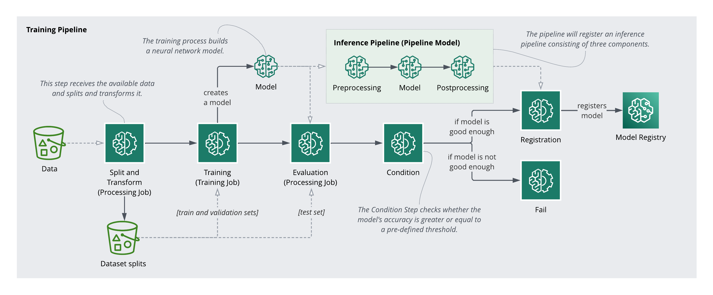
</p>

- We’ll use a [Scikit-Learn Pipeline](https://scikit-learn.org/stable/modules/generated/sklearn.pipeline.Pipeline.html) for the transformations, and a [Processing Step](https://docs.aws.amazon.com/sagemaker/latest/dg/build-and-manage-steps.html#step-type-processing) with a [SKLearnProcessor](https://sagemaker.readthedocs.io/en/stable/frameworks/sklearn/sagemaker.sklearn.html#scikit-learn-processor) to execute a preprocessing script. Check the [SageMaker Pipelines Overview](https://docs.aws.amazon.com/sagemaker/latest/dg/pipelines-sdk.html) for an introduction to the fundamental components of a SageMaker Pipeline.

### Step 1: Exploratory Data Analysis (EDA)

- `Note`: This step has nothing to do with the pipeline

- Let’s run EDA on the dataset. The goal of this section is to understand the data and the problem we are trying to solve.

- Let’s load the Penguins dataset:

```
import pandas as pd
import numpy as np

penguins = pd.read_csv(DATA_FILEPATH)
penguins.head()
```
<p align="left">
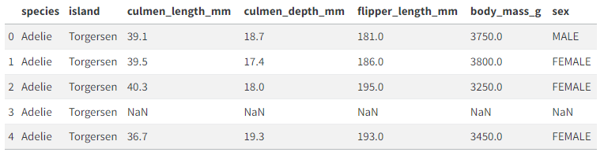
</p>

- We can see the dataset contains the following columns:

    - `species`: The species of a penguin. This is the column we want to predict.
    - `island`: The island where the penguin was found
    - `culmen_length_mm`: The length of the penguin’s culmen (bill) in millimeters
    - `culmen_depth_mm`: The depth of the penguin’s culmen in millimeters
    - `flipper_length_mm`: The length of the penguin’s flipper in millimeters
    - `body_mass_g`: The body mass of the penguin in grams
    - `sex`: The sex of the penguin

- If you are curious, here is the description of a penguin’s culmen:

<p align="left">

</p>

- Now, let’s get the `summary statistics` for the features in our dataset.

```
penguins.describe(include="all")
```

<p align="left">
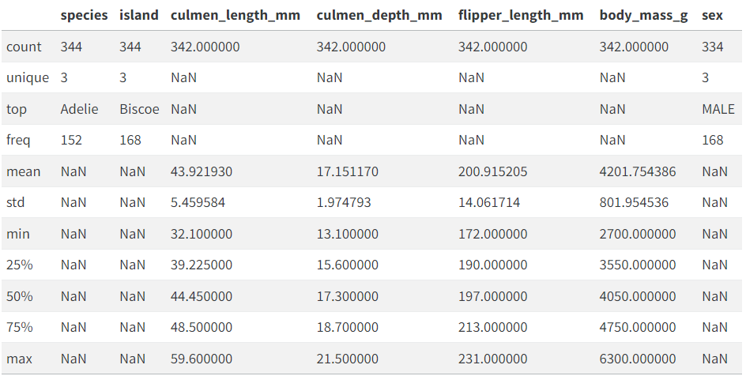
</p>

- Let’s now display the distribution of values for the three categorical columns in our data:

```
species_distribution = penguins["species"].value_counts()
island_distribution = penguins["island"].value_counts()
sex_distribution = penguins["sex"].value_counts()

print(species_distribution)
print()
print(island_distribution)
print()
print(sex_distribution)
```
<p align="left">
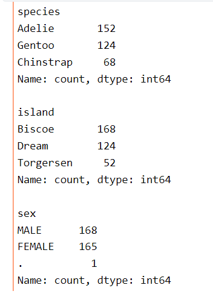
</p>

- The distribution of the categories in our data are:

    - `species`: There are 3 species of penguins in the dataset: Adelie (152), Gentoo (124), and Chinstrap (68).
    - `island`: Penguins are from 3 islands: Biscoe (168), Dream (124), and Torgersen (52).
    - `sex`: We have 168 male penguins, 165 female penguins, and 1 penguin with an ambiguous gender (.).

- Let’s replace the ambiguous value in the sex column with a null value:

```
penguins["sex"] = penguins["sex"].replace(".", np.nan)
sex_distribution = penguins["sex"].value_counts()
sex_distribution
```
<p align="left">
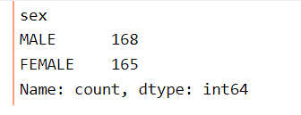
</p>

- Next, let’s check for any `missing values` in the dataset.

```
penguins.isnull().sum()
```
<p align="left">
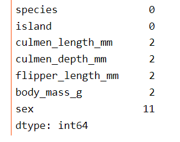
</p>

- Let’s get rid of the missing values. For now, we are going to replace the missing values with the most frequent value in the column. Later, we’ll use a different strategy to replace missing numeric values.

```
from sklearn.impute import SimpleImputer

imputer = SimpleImputer(strategy="most_frequent")
penguins.iloc[:, :] = imputer.fit_transform(penguins)
penguins.isnull().sum()
```
<p align="left">
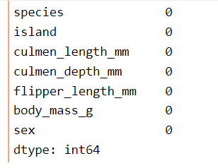
</p>

- Let’s visualize the distribution of `categorical features`.

```
import matplotlib.pyplot as plt

fig, axs = plt.subplots(3, 1, figsize=(6, 10))

axs[0].bar(species_distribution.index, species_distribution.values)
axs[0].set_ylabel("Count")
axs[0].set_title("Distribution of Species")

axs[1].bar(island_distribution.index, island_distribution.values)
axs[1].set_ylabel("Count")
axs[1].set_title("Distribution of Island")

axs[2].bar(sex_distribution.index, sex_distribution.values)
axs[2].set_ylabel("Count")
axs[2].set_title("Distribution of Sex")

plt.tight_layout()
plt.show()
```
<p align="left">
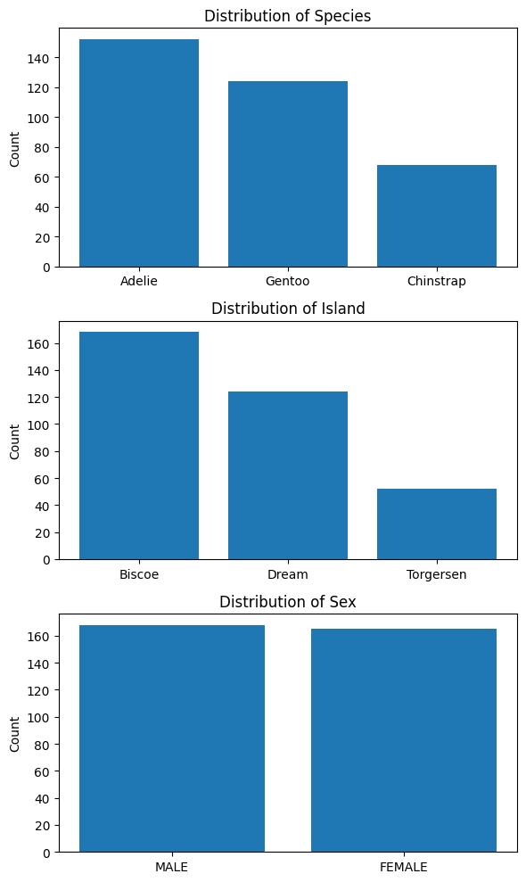
</p>

- Let’s visualize the distribution of `numerical columns`.

```
fig, axs = plt.subplots(2, 2, figsize=(8, 6))

axs[0, 0].hist(penguins["culmen_length_mm"], bins=20)
axs[0, 0].set_ylabel("Count")
axs[0, 0].set_title("Distribution of culmen_length_mm")

axs[0, 1].hist(penguins["culmen_depth_mm"], bins=20)
axs[0, 1].set_ylabel("Count")
axs[0, 1].set_title("Distribution of culmen_depth_mm")

axs[1, 0].hist(penguins["flipper_length_mm"], bins=20)
axs[1, 0].set_ylabel("Count")
axs[1, 0].set_title("Distribution of flipper_length_mm")

axs[1, 1].hist(penguins["body_mass_g"], bins=20)
axs[1, 1].set_ylabel("Count")
axs[1, 1].set_title("Distribution of body_mass_g")

plt.tight_layout()
plt.show()
```

<p align="left">
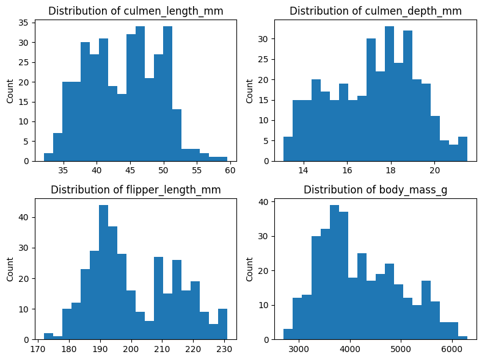
</p>

- Let’s display the covariance matrix of the dataset. The “covariance” measures how changes in one variable are associated with changes in a second variable. In other words, the covariance measures the degree to which two variables are linearly associated.

```
penguins.cov(numeric_only=True)
```
<p align="left">
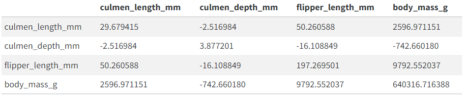
</p>

- Here are three examples of what we get from interpreting the covariance matrix below:

    - Penguins that weight more tend to have a larger culmen.
    - The more a penguin weights, the shallower its culmen tends to be.
    - There’s a small variance between the culmen depth of penguins.

- Let’s now display the correlation matrix. “Correlation” measures both the strength and direction of the linear relationship between two variables.

```
penguins.corr(numeric_only=True)
```
<p align="left">
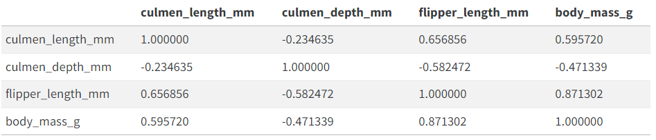
</p>

- Here are three examples of what we get from interpreting the correlation matrix below:

    - Penguins that weight more tend to have larger flippers.
    - Penguins with a shallower culmen tend to have larger flippers.
    - The length and depth of the culmen have a slight negative correlation.


- Let’s display the distribution of species by island.

```
unique_species = penguins["species"].unique()

fig, ax = plt.subplots(figsize=(6, 6))
for species in unique_species:
    data = penguins[penguins["species"] == species]
    ax.hist(data["island"], bins=5, alpha=0.5, label=species)

ax.set_xlabel("Island")
ax.set_ylabel("Count")
ax.set_title("Distribution of Species by Island")
ax.legend()
plt.show()
```
<p align="left">
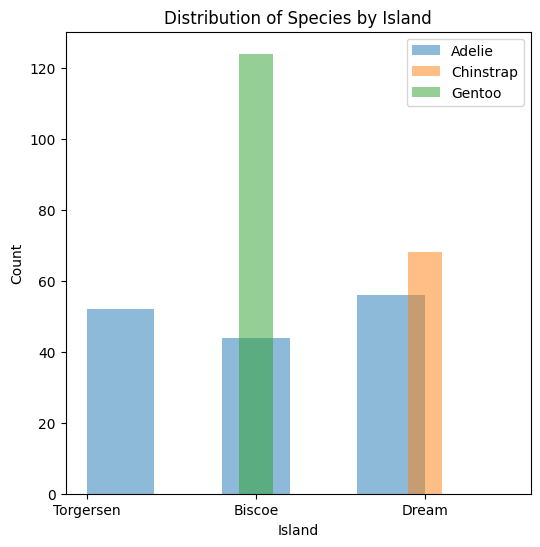
</p>

- Let’s display the distribution of species by sex.

```
fig, ax = plt.subplots(figsize=(6, 6))

for species in unique_species:
    data = penguins[penguins["species"] == species]
    ax.hist(data["sex"], bins=3, alpha=0.5, label=species)

ax.set_xlabel("Sex")
ax.set_ylabel("Count")
ax.set_title("Distribution of Species by Sex")

ax.legend()
plt.show()
```
<p align="left">
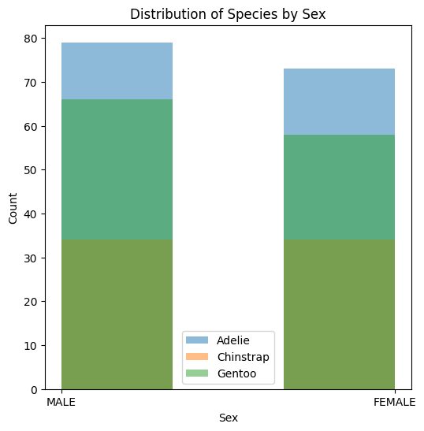
</p>


### Step 2: Creating the Preprocessing Script

- Fetch the data from S3 bucket on AWS and send it to a `processing job` (job running on AWS)
- Processing Job: Sagemake is creating a job that's gonna run on the cloud
- Processing Job splits the data into 3 sets and transforms and the output of this job gets stored back on S3 location called `Dataset splits`:
    - `Training set`
    - `Validation set`
    - `Test set`


### Step 3: Setting up the Processing Step

- Let's now define the [ProcessingStep](https://sagemaker.readthedocs.io/en/stable/workflows/pipelines/sagemaker.workflow.pipelines.html#sagemaker.workflow.steps.ProcessingStep) that we'll use in the pipeline to run the script that will split and transform the data.

- When you're working in a pipeline, you access a `processing job` by creating a `ProcessingStep` in a SageMaker Pipeline.

- Several SageMaker Pipeline steps support `caching`. When a step runs, and dependending on the configured caching policy, SageMaker will try to reuse the result of a previous successful run of the same step. You can find more information about this topic in [Caching Pipeline Steps](https://docs.aws.amazon.com/sagemaker/latest/dg/pipelines-caching.html). Let's define a caching policy that we'll reuse on every step:

``` 
from sagemaker.workflow.steps import CacheConfig

cache_config = CacheConfig(enable_caching=True, expire_after="15d")

```

- To define a `ProcessingStep` in SageMaker, first you need to define a `processor`

- A `processor` gives the `ProcessingStep` information about the hardware and software that SageMaker should use to launch the Processing Job. To run the script we created, we need access to Scikit-Learn, so we can use the [SKLearnProcessor](https://sagemaker.readthedocs.io/en/stable/frameworks/sklearn/sagemaker.sklearn.html#scikit-learn-processor) processor that comes out-of-the-box with the SageMaker's Python SDK. 

- A processor is basically telling SageMaker to install a container in the cloud to run this job

- SageMaker manages the infrastructure of a Processing Job. It provisions resources for the duration of the job, and cleans up when it completes. The Processing Container image that SageMaker uses to run a Processing Job can either be a SageMaker built-in image or a custom image.

- Once we configure the `processor`, we can configure the processing step

<p align="left">
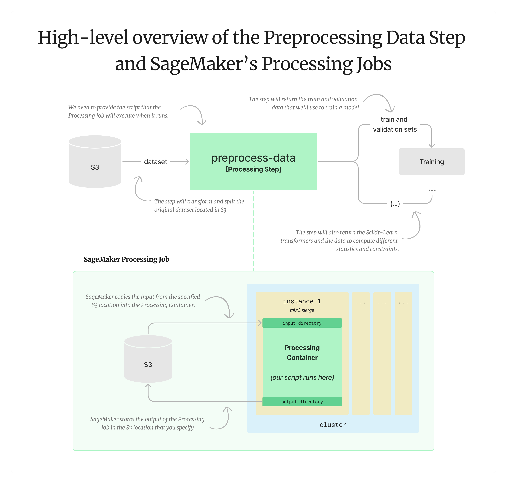
</p>

- We have data coming from S3, the `processing step` called `preprocess-data` will split the data into 3 sets and then transform it. The output of this step is that the training and validation set will go to the next pipeline (`training step`) that we will create in the next step

- The bottom part in the diagram shows how the processing job looks (behind the scenes). When we define a step we add it to the pipeline and then we execute the pipeline (and there will a processing job running behind the scenes). Here, the processing job takes data from S3 as input and copies the data to a processing container which is on cloud. This will be an instance (ml.t3.xlarge). This instance will have a ccontainer inside, along with input directory where s3 data gets copied to, our script will run in this processing container, save the data in output directory and this output directory will automatically gets uploaded by SageMaker

- In short, The processing job grabs data from S3, copies the data in processing container, runs the script, grabs the output and uploads it to S3

### Step 4: Creating the Pipeline

- Create the SageMaker Pipeline and submit its definition to the SageMaker Pipelines service to create the pipeline if it doesn't exist or update it if it does

```
from sagemaker.workflow.pipeline import Pipeline
from sagemaker.workflow.pipeline_definition_config import PipelineDefinitionConfig

pipeline_definition_config = PipelineDefinitionConfig(use_custom_job_prefix=True)

step1-pipeline = Pipeline(
    name="step1-pipeline",
    parameters=[dataset_location],
    steps=[
        preprocessing_step,
    ],
    pipeline_definition_config=pipeline_definition_config,
    sagemaker_session=config["session"],
)

step1-pipeline.upsert(role_arn=role)
```
- To summarize Processing step:
    - Use a processing step to create a processing job for data processing
    - A processing step requires a processor, a Python script that defines the processing code, outputs for processing, and job arguments

## 2. Training Pipeline - Split and Transform (Processing Job)

- This section extends the [SageMaker Pipeline](https://docs.aws.amazon.com/sagemaker/latest/dg/pipelines-sdk.html) we built in the previous session with a step to train a model. We’ll explore the [Training Step](https://docs.aws.amazon.com/sagemaker/latest/dg/build-and-manage-steps.html#step-type-training) and the [Tuning Step](https://docs.aws.amazon.com/sagemaker/latest/dg/build-and-manage-steps.html#step-type-tuning).

- We’ll introduce [Amazon SageMaker Experiments](https://docs.aws.amazon.com/sagemaker/latest/dg/experiments.html) and use them during training. For more information about this topic, check the [SageMaker Experiments’ SDK documentation](https://sagemaker.readthedocs.io/en/v2.174.0/experiments/sagemaker.experiments.html).


### Step 1: Creating the Training Script
- Here’s a high-level overview of the training step and the Training Job that SageMaker creates behind the scenes:

<p align="left">
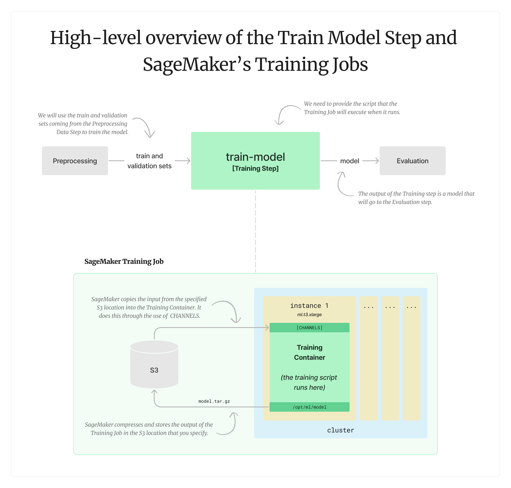
</p>

- This following script is responsible for training a neural network using the train data, validating the model, and saving it so we can later use it:

- `Note`: 
    - We control the arguments epoch and batch size
    - Train function paramters include model directory(SM_MODEL_DIR) - directory where the model should be saved. When we train the model, the assets should be saved in this directory. By doing so we tell SageMaker where the output of this training job should be  - SM comes from SageMaker, so when SageMaker runs one of this training jobs, SageMaker will define a bunch of envirnoment variables that you can use for whatever you need them. We can see these variables in the logs  train path, validation path, epochs, and batch size
    - SageMaker passes data into the training job through channels. That's why we have channels from training and validation(you get directories)
    - 

```
import os
import argparse

import numpy as np
import pandas as pd

from pathlib import Path
from sklearn.metrics import accuracy_score

from tensorflow.keras.models import Sequential
from tensorflow.keras.layers import Dense
from tensorflow.keras.optimizers import SGD


def train(model_directory, train_path, validation_path, epochs=50, batch_size=32):
    X_train = pd.read_csv(Path(train_path) / "train.csv")
    y_train = X_train[X_train.columns[-1]]
    X_train.drop(X_train.columns[-1], axis=1, inplace=True)
    
    X_validation = pd.read_csv(Path(validation_path) / "validation.csv")
    y_validation = X_validation[X_validation.columns[-1]]
    X_validation.drop(X_validation.columns[-1], axis=1, inplace=True)
        
    model = Sequential([
        Dense(10, input_shape=(X_train.shape[1],), activation="relu"),
        Dense(8, activation="relu"),
        Dense(3, activation="softmax"),
    ])
    
    model.compile(
        optimizer=SGD(learning_rate=0.01),
        loss="sparse_categorical_crossentropy",
        metrics=["accuracy"]
    )

    model.fit(
        X_train, 
        y_train, 
        validation_data=(X_validation, y_validation),
        epochs=epochs, 
        batch_size=batch_size,
        verbose=2,
    )

    predictions = np.argmax(model.predict(X_validation), axis=-1)
    print(f"Validation accuracy: {accuracy_score(y_validation, predictions)}")
    
    model_filepath = Path(model_directory) / "001"
    model.save(model_filepath)    
    

if __name__ == "__main__":
    # Any hyperparameters provided by the training job are passed to 
    # the entry point as script arguments. 
    parser = argparse.ArgumentParser()
    parser.add_argument("--epochs", type=int, default=50)
    parser.add_argument("--batch_size", type=int, default=32)
    args, _ = parser.parse_known_args()

    train(
        # This is the location where we need to save our model. SageMaker will
        # create a model.tar.gz file with anything inside this directory when
        # the training script finishes.
        model_directory=os.environ["SM_MODEL_DIR"],

        # SageMaker creates one channel for each one of the inputs to the
        # Training Step.
        train_path=os.environ["SM_CHANNEL_TRAIN"],
        validation_path=os.environ["SM_CHANNEL_VALIDATION"],

        epochs=args.epochs,
        batch_size=args.batch_size,
    )
```
- `Activation fucntions` = Relu, softmax
- `optimizer` = SDG
- `Learning rate` = 0.01
- `Loss` = sparse categorical entropy
- `Metrics` = accuracy
- Version the model_filepath so that tensorflow serving can understand it(useful while serving the model)

### Step 2: Setup the Training Step
- We can now create a [Training Step](https://docs.aws.amazon.com/sagemaker/latest/dg/build-and-manage-steps.html#step-type-training) that we can add to the pipeline. This Training Step will create a SageMaker Training Job in the background, run the training script, and upload the output to S3. Check the TrainingStep SageMaker’s SDK documentation for more information.
- SageMaker uses the concept of an [Estimator](https://sagemaker.readthedocs.io/en/stable/api/training/estimators.html) to handle end-to-end training and deployment tasks. For this example, we will use the built-in [TensorFlow Estimator](https://sagemaker.readthedocs.io/en/stable/frameworks/tensorflow/sagemaker.tensorflow.html#tensorflow-estimator) to run the training script we wrote before. (Just like we defined `processor` in the `processing step`, we need to define a `estimator` in the `training step`)
- SageMaker manages the infrastructure of a Training Job. It provisions resources for the duration of the job, and cleans up when it completes. The Training Container image that SageMaker uses to run a Training Job can either be a SageMaker built-in image or a custom image.
- We have base job name as "training" that appears on sageMaker UI under training section
- Notice the list of hyperparameters defined below. SageMaker will pass these hyperparameters as arguments to the entry point of the training script. (Pass the hyperparameters to the entry point of the estimator)
- We are going to use [SageMaker Experiments](https://sagemaker.readthedocs.io/en/v2.174.0/experiments/sagemaker.experiments.html) to log information from the Training Job. For more information, check [Manage Machine Learning with Amazon SageMaker Experiments](https://docs.aws.amazon.com/sagemaker/latest/dg/experiments.html). The list of metric definitions will tell SageMaker which metrics to track and how to parse them from the Training Job logs.

```
from sagemaker.tensorflow import TensorFlow

estimator = TensorFlow(
    base_job_name="training",
    entry_point=f"{CODE_FOLDER}/train.py",
    # SageMaker will pass these hyperparameters as arguments
    # to the entry point of the training script.
    hyperparameters={
        "epochs": 50,
        "batch_size": 32,
    },
    # SageMaker will track these metrics as part of the experiment
    # associated to this pipeline. The metric definitions tells
    # SageMaker how to parse the values from the Training Job logs.
    metric_definitions=[
        {"Name": "loss", "Regex": "loss: ([0-9\\.]+)"},
        {"Name": "accuracy", "Regex": "accuracy: ([0-9\\.]+)"},
        {"Name": "val_loss", "Regex": "val_loss: ([0-9\\.]+)"},
        {"Name": "val_accuracy", "Regex": "val_accuracy: ([0-9\\.]+)"},
    ],
    image_uri=config["image"],
    framework_version=config["framework_version"],
    py_version=config["py_version"],
    instance_type=config["instance_type"],
    instance_count=1,
    disable_profiler=True,
    sagemaker_session=config["session"],
    role=role,
)
```


- We can now create a [Training Step](https://docs.aws.amazon.com/sagemaker/latest/dg/build-and-manage-steps.html#step-type-training)). This Training Step will create a SageMaker Training Job in the background, run the training script, and upload the output to S3. Check the [TrainingStep](https://sagemaker.readthedocs.io/en/stable/workflows/pipelines/sagemaker.workflow.pipelines.html#sagemaker.workflow.steps.TrainingStep) SageMaker’s SDK documentation for more information.
- This step will receive the train and validation split from the previous step as inputs.
- Here, we are using two input channels, train and validation. SageMaker will automatically create an environment variable corresponding to each of these channels following the format `SM_CHANNEL_[channel_name]`:
    - `SM_CHANNEL_TRAIN`: This environment variable will contain the path to the data in the train channel
    - `SM_CHANNEL_VALIDATION`: This environment variable will contain the path to the data in the validation channel

```
from sagemaker.workflow.steps import TrainingStep
from sagemaker.inputs import TrainingInput

# Get the training data and validation data from processing step and fit it on the estimator
train_model_step = TrainingStep(
    name="train-model",
    step_args=estimator.fit(
        inputs={
            "train": TrainingInput(
                s3_data=preprocessing_step.properties.ProcessingOutputConfig.Outputs[
                    "train"
                ].S3Output.S3Uri,
                content_type="text/csv",
            ),
            "validation": TrainingInput(
                s3_data=preprocessing_step.properties.ProcessingOutputConfig.Outputs[
                    "validation"
                ].S3Output.S3Uri,
                content_type="text/csv",
            ),
        }
    ),
    cache_config=cache_config,
)
```


### Step 3: Setup the Training Step
- Let’s now create a Tuning Step. This Tuning Step will create a SageMaker Hyperparameter Tuning Job in the background and use the training script to train different model variants and choose the best one. Check the TuningStep SageMaker’s SDK documentation for more information.
- Since we could use the Training of the Tuning Step to create the model, we’ll define this constant to indicate which approach we want to run. Notice that the Tuning Step is not supported in Local Mode.

```
USE_TUNING_STEP = False and not LOCAL_MODE
```
- The Tuning Step requires a HyperparameterTuner reference to configure the Hyperparameter Tuning Job.

- Here is the configuration that we’ll use to find the best model:

    - `objective_metric_name`: This is the name of the metric the tuner will use to determine the best model.
    - `objective_type`: This is the objective of the tuner. It specifies whether it should minimize the metric or maximize it. In this example, since we are using the validation accuracy of the model, we want the objective to be “Maximize.” If we were using the loss of the model, we would set the objective to “Minimize.”
    - `metric_definitions`: Defines how the tuner will determine the metric’s value by looking at the output logs of the training process.

- The tuner expects the list of the hyperparameters you want to explore. You can use subclasses of the Parameter class to specify different types of hyperparameters. This example explores different values for the epochs hyperparameter.

- Finally, you can control the number of jobs and how many of them will run in parallel using the following two arguments:

    - `max_jobs`: Defines the maximum total number of training jobs to start for the hyperparameter tuning job.
    - `max_parallel_jobs`: Defines the maximum number of parallel training jobs to start.

```
from sagemaker.tuner import HyperparameterTuner
from sagemaker.parameter import IntegerParameter

tuner = HyperparameterTuner(
    estimator,
    objective_metric_name="val_accuracy",
    objective_type="Maximize",
    hyperparameter_ranges={
        "epochs": IntegerParameter(10, 50),
    },
    metric_definitions=[{"Name": "val_accuracy", "Regex": "val_accuracy: ([0-9\\.]+)"}],
    max_jobs=3,
    max_parallel_jobs=3,
)
```

- We can now create the Tuning Step using the tuner we configured before.

- Here’s a high-level overview of this step and the Hyperparameter Tuning Job that SageMaker creates behind the scenes:

<p align="left">
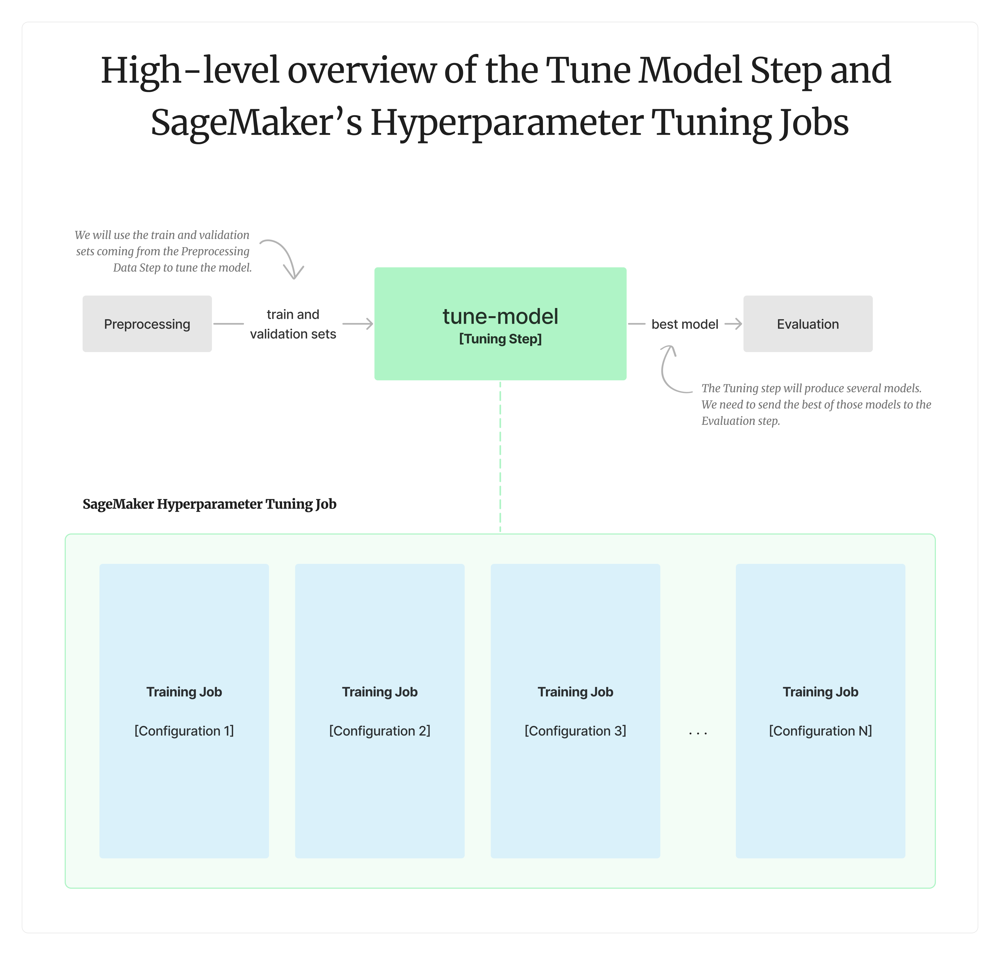
</p>

```
from sagemaker.workflow.steps import TuningStep

tune_model_step = TuningStep(
    name="tune-model",
    step_args=tuner.fit(
        inputs={
            "train": TrainingInput(
                s3_data=preprocessing_step.properties.ProcessingOutputConfig.Outputs[
                    "train"
                ].S3Output.S3Uri,
                content_type="text/csv",
            ),
            "validation": TrainingInput(
                s3_data=preprocessing_step.properties.ProcessingOutputConfig.Outputs[
                    "validation"
                ].S3Output.S3Uri,
                content_type="text/csv",
            ),
        },
    ),
    cache_config=cache_config,
)
```

### Step 4: Creating the Pipeline

- Let’s define the SageMaker Pipeline and submit its definition to the SageMaker Pipelines service to create the pipeline if it doesn’t exist or update it if it does.

```
session2_pipeline = Pipeline(
    name="step2-pipeline",
    parameters=[dataset_location],
    steps=[
        preprocessing_step,
        tune_model_step if USE_TUNING_STEP else train_model_step,
    ],
    pipeline_definition_config=pipeline_definition_config,
    sagemaker_session=config["session"],
)

session2_pipeline.upsert(role_arn=role)
```
- We can now start the pipeline:

```
step2-pipeline.start()
```


## Running the code

Before running the project, follow the [Setup instructions](https://program.ml.school/setup.html). After that, you can test the code by running the following command:

```
$ nbdev_test --path program/cohort.ipynb
```

This will run the notebook and make sure everything runs. If you have any problems, it's likely there's a configuration issue in your setup.

## Resources

* [Serving a TensorFlow model from a Flask application](program/serving/flask/README.md): A simple Flask application that serves a multi-class classification TensorFlow model to determine the species of a penguin.
